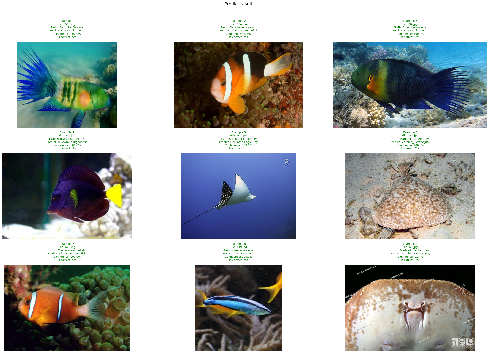
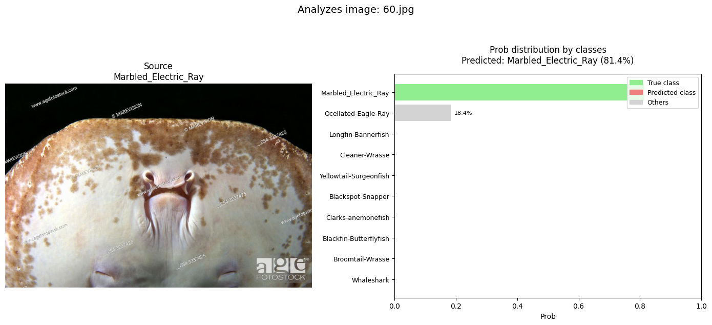

# practice_1
Практика 1 семестра, Мифи, Машинное обучение.

# Reef Biodiversity Monitoring System — Proof of Concept

## 1. Бизнес-постановка
Бахрейн, как страна с высокой зависимостью от туризма, нуждается в инструментах мониторинга состояния коралловых рифов. Основная цель — разработка системы анализа биоразнообразия рифов для регулирования судоходства и дайвинг-туризма. В качестве индикатора состояния рифа используется видовое разнообразие рыб.

Государство выступило заказчиком аналитической системы, требующей применения технологий Computer Vision для автоматического распознавания видов рыб.

## 2. Концепция решения
Предполагается внедрение программы, в рамках которой дайверы будут загружать фотографии рыб, сделанные на рифах. Система будет автоматически классифицировать виды рыб и передавать данные для дальнейшего экологического анализа.

На текущем этапе выполнен proof-of-concept, подтверждающий техническую реализуемость механизма распознавания.

## 3. Исходные данные
- **Базовая модель:** [Veda0718/swin-tiny-patch4-window7-224-finetuned-fish](https://huggingface.co/Veda0718/swin-tiny-patch4-window7-224-finetuned-fish) (Hugging Face)
- **Датасет для дообучения:** [Qatar Tropical Fishes 10 (QTF-10)](https://www.kaggle.com/datasets/naumanullah/qatar-tropical-fishes-10-qtf-10) с Kaggle

## 4. Выполненная работа
Модель успешно дообучена на предоставленном датасете. Реализована возможность классификации рыб с выдачей человекочитаемых результатов.

## 5. Результаты
- **Артефакты дообучения и примеры работы модели:** [Google Drive](https://drive.google.com/drive/folders/1u1iEa0zMPPRN3Zjl6myS4Yy5GZTLQq9Z?usp=sharing)
- Для запуска модели загрузить приложенный ноутбук в Colab и нажать Run all, результаты тестирования модели будут в самой последней ячейке

## 6. Визуализация результата

*Рисунок 1: Пример работы модели по классификации видов рыб*

*Рисунок 2: Детализированный вывод классификации*

## 7. Вывод
Proof-of-concept подтвердил работоспособность предложенного подхода. Модель корректно классифицирует виды рыб на изображениях и готова к интеграции в пилотную систему.

## 8. Дальнейшие шаги
Планируется расширение функциональности системы за счет:
- Привязки геолокации к каждому наблюдению
- Добавления временных меток
- Создания механизмов отслеживания динамики состояния рифов во времени и пространстве

Система предназначена для формирования аналитической платформы, поддерживающей принятие решений по охране морских экосистем и регулированию рекреационной нагрузки.
